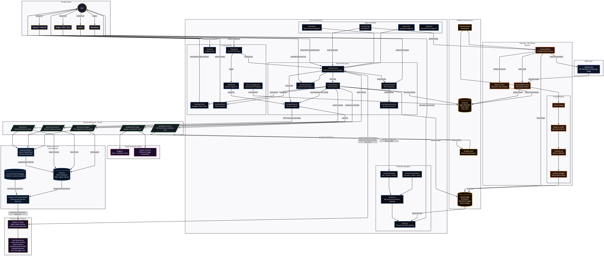

# LXXI — Voice-First AI Creation Platform

**Voice is for Vibe. Screen is for Substance.**

LXXI (Seventy-One) is a real-time voice AI platform where users create persistent AI characters with souls, 3D avatars, and long-term memory. Characters see you through your camera, speak to you in real time, remember every conversation, and build alongside you — generating images, writing code, and thinking through problems as true creative partners.

> **Hackathon demo?** See the [Demo Instructions](DEMO_INSTRUCTIONS.md) for a step-by-step walkthrough.

---

## The Problem

Every AI tool resets to zero. You explain your project, get a smart answer, close the tab, and start over the next day from nothing. The AI has no memory of you, no awareness of what you built together, no presence in your actual world.

LXXI is built around **presence**, not access. The agent is always on, always watching, always accumulating context. A tool resets. A partner compounds.

---

## Core Architecture

### Two Modes

| Mode | Name | Purpose |
|------|------|---------|
| **Prime** | The Forge | Build an AI business partner with a soul. Voice conversations, image generation, code creation, persistent memory. |
| **Spark** | Leo's Learning Lab | A friendly AI tutor for kids. Voice-first learning with a visual chalkboard for math, science, Spanish, and general curiosity. |

### How It Works (Prime)

1. **Describe** — Speak to The Architect. A voice interview shapes your character's personality, archetype, and backstory.
2. **Upload** — Drop an image to generate a rigged, animated 3D avatar via Tripo3D.
3. **Create** — Enter the workspace. Your agent sees you through the camera, speaks in real time, generates images (Imagen 4), writes code, searches its own memory, and builds alongside you.

---

## Technical Stack

### Frontend
- **Next.js 14** (App Router) + **React 18** + **TypeScript**
- **Three.js** / **React Three Fiber** / **Drei** — 3D avatar rendering with real-time mouth animation
- **Tailwind CSS** — Dark theme with gold (#d4af37) accents, glass morphism effects

### AI Layer
- **Gemini Multimodal Live API** — Real-time bidirectional WebSocket for voice + vision
- **Gemini 2.5 Flash** (native audio) — Sub-second voice responses with native speech
- **Gemini Embedding 001** — 768-dimension embeddings for semantic memory
- **Imagen 4** — High-fidelity image generation (standard, ultra, fast tiers)

### Backend & Storage
- **Firebase Auth** — Google Sign-In
- **Cloud Firestore** — Agent profiles, lore documents, vault items, session state
- **Firebase Cloud Storage** — GLB models, generated images, source uploads
- **Firebase Cloud Functions** — Task queue for 3D generation pipeline
- **Pinecone** — Vector database for long-term semantic memory (namespace-isolated per user+agent)

### 3D Generation Pipeline
- **Tripo3D API** — Image-to-3D model generation with automatic rigging and animation retargeting
- **Alchemy SDK** — NFT metadata retrieval for Web3-native character creation

---

## System Architecture



```
User (Voice + Camera)
    |
    v
[Gemini Live WebSocket] <-- Real-time audio + video frames
    |
    |-- Voice Response --> [Audio Playback] --> [Frequency Analysis] --> [Mouth Morphs on 3D Avatar]
    |-- Tool Calls ------> [useToolHandlers]
    |                           |-- create_vault_artifact --> [Imagen 4 API] --> [Firebase Storage] --> [Floating Artifact]
    |                           |-- createDocumentArtifact --> [Code/Doc Card]
    |                           |-- search_memory ----------> [Pinecone Vector Search]
    |                           |-- displayChalkboard ------> [Chalkboard Card] (Spark mode)
    |                           |-- create_learning_visual -> [CountingVisual] (math) / [Imagen 4] (other)
    |                           |-- record_progress --------> [Learner Profile] (Spark mode)
    |
    |-- Transcripts -----> [Memory Buffer] --> [Gemini Embedding] --> [Pinecone]
    |
    v
[Firestore] <-- Agent profiles, lore, vault persistence
```

---

## Key Systems

### Voice Pipeline
Real-time bidirectional WebSocket with Gemini Live. User audio captured via AudioWorklet at 24kHz, downsampled to 16kHz PCM. Incoming audio decoded and played through Web Audio API. Frequency analysis extracts jaw position and mouth width for real-time avatar lip sync.

### 3D Avatar System
Loads GLB models via useGLTF + SkeletonUtils clone. Auto-detects skeleton conventions (Mixamo, Tripo, Blender). Repairs animation track names across naming schemes. Creates procedural mouth morph targets from audio frequency bands. Smooth crossfade transitions between idle, speaking, thinking, and greeting animations.

### Memory System
All conversation utterances are vectorized via Gemini Embedding 001 and stored in Pinecone with namespace isolation (`{userId}_{agentId}`). At session start, relevant memories are recalled via semantic search and injected into the system instruction, giving the agent awareness of past interactions.

### Vision Pipeline
Webcam frames captured at adaptive intervals (2-16 seconds), encoded as JPEG, and sent to Gemini Live alongside audio. Enables the agent to see documents, physical objects, whiteboards, or anything the user holds up to the camera.

### Vault System
Multi-modal artifact storage for images, code, and documents. Generated assets persist to Firebase Storage and Firestore. Displayed as floating glass cards over the 3D avatar workspace (max 5 visible, newest on top). All items downloadable.

### Adaptive Tutoring (Spark)
Leo's Learning Lab uses an adaptive learner profile system that tracks student progress across subjects (math, Spanish, science). Difficulty scales automatically based on streak performance. Programmatic `CountingVisual` renders exact emoji groups for math problems (no AI image generation needed for accurate counting). Spanish and science use AI-generated visuals as learning aids.

### 3D Generation Pipeline
User uploads an image (or connects an NFT via Alchemy). Firebase Cloud Function sends the image through Tripo3D's pipeline: image-to-model, automatic skeleton rigging, animation retargeting from template. Final GLB stored in Firebase Storage. Frontend polls Firestore status and transitions to live workspace when ready.

---

## Project Structure

```
app/
  page.tsx              Landing page — hero, two paths (Prime/Spark), Architect interview
  workspace/page.tsx    Live workspace — full-screen avatar, floating artifacts, toolbar
  spark/page.tsx        Leo's Learning Lab — voice tutoring with chalkboard + counting visuals
  manifesto/page.tsx    Philosophy and core principles
  api/
    gemini-session/     GET  — Returns Gemini API key for WebSocket (rate-limited)
    generate-image/     POST — Imagen 4 generation (standard or reference-based)
    memory/             POST — Save utterance embedding to Pinecone
    memory/search/      POST — Semantic search across agent memory
    memory/ingest/      POST — Bulk file ingestion (PDF, images)

components/
  3d/
    Scene.tsx             Three.js canvas, lighting, camera, OrbitControls
    Avatar.tsx            Core avatar: GLB loading, animation, mouth morphs, bone detection
  ui/
    FloatingArtifact.tsx  Glass card for vault items (images, code, docs)
    SharePanel.tsx        File/image attachment panel with auto-send for voice sessions
    WorkspaceToolbar.tsx  Bottom bar: voice toggle, upload, clear, status
    DropZone.tsx          Image upload for 3D generation
    DocumentCard.tsx      Syntax-highlighted code display
    ChalkboardCard.tsx    Math/Spanish/science problem card (Spark mode)
    CountingVisual.tsx    Programmatic emoji counting groups for math (exact counts)
    VoiceOrb.tsx          Animated voice activity indicator (Spark mode)
    StepIndicator.tsx     3-step progress (Describe → Upload → Generate)
    LoginButton.tsx       Firebase Google Auth with session disconnect on logout
    AgentLibrary.tsx      Browse and switch between saved agents
    DemoLimitBanner.tsx   Demo tier usage limit notification
    ActiveLoadingScreen.tsx  3D generation pipeline progress display
    IngestPanel.tsx       PDF/file ingestion for agent memory
    IPVault.tsx           Vault browser overlay

hooks/
  useGeminiLive.ts        Core hook: WebSocket, audio, transcripts, tool dispatch
  useToolHandlers.ts      Processes Gemini tool calls (image gen, code, memory, chalkboard)
  useAgentMemory.ts       Vectorize + store utterances in Pinecone
  useFrequencyAnalysis.ts Audio spectrum → viseme data for mouth animation
  useAudioPlayback.ts     PCM buffer scheduling for seamless audio output
  useVisionPipeline.ts    Webcam frame capture and encoding for Gemini

lib/
  firebase.ts             Firebase client SDK initialization
  firebaseAdmin.ts        Firebase Admin SDK (server-side)
  systemInstructions.ts   Build workspace system prompt with lore + memories
  embeddings.ts           Gemini Embedding API wrapper
  learnerProfile.ts       Student profile/progress tracking (localStorage)
  adminWhitelist.ts       Admin email whitelist check
  anonymousId.ts          Persistent anonymous user ID (localStorage)
  getAuthToken.ts         Firebase Auth header utility
  storageUtils.ts         Firebase Storage upload utilities
  vaultUtils.ts           Firestore vault persistence
  theme.tsx               Prime/Spark theme provider
  agents/
    architect.ts          The Architect config (character creation interview)
    tutor.ts              Leo tutor config (Spark mode — system prompt + tools)
    demoWow.ts            Default demo agent config

types/
  lxxi.ts                VaultItem union type, StagedFile, mode definitions

functions/
  src/index.ts            Cloud Functions: enqueue3DTask, process3DExtrusion

public/
  WOW.glb                Default female avatar (mouth morphs, Tripo skeleton)
  leo.glb                Leo tutor avatar (Spark + Forge KANE demo)
  lxxi-logo.png          LXXI logo
  audio-processor.js     AudioWorklet for PCM capture
  hdri/                  Environment lighting (HDR)
  draco/                 GLTF decompression (WASM)
```

---

## Environment Variables

### Frontend (`.env.local`)
```env
# Firebase Client Config
NEXT_PUBLIC_FIREBASE_API_KEY=
NEXT_PUBLIC_FIREBASE_AUTH_DOMAIN=
NEXT_PUBLIC_FIREBASE_PROJECT_ID=
NEXT_PUBLIC_FIREBASE_STORAGE_BUCKET=
NEXT_PUBLIC_FIREBASE_MESSAGING_SENDER_ID=
NEXT_PUBLIC_FIREBASE_APP_ID=

# Firebase Admin (server-side)
FIREBASE_CLIENT_EMAIL=
FIREBASE_PRIVATE_KEY=

# Gemini API
GEMINI_API_KEY=

# Pinecone (vector memory)
PINECONE_API_KEY=

# Admin whitelist (comma-separated emails for full access)
NEXT_PUBLIC_ADMIN_EMAILS=
```

### Cloud Functions (`functions/.env`)
```env
TRIPO_API_KEY=       # Tripo3D 3D generation
ALCHEMY_API_KEY=     # NFT metadata (optional)
GEMINI_API_KEY=      # Gemini Vision for image analysis
```

---

## Getting Started

```bash
# Install dependencies
npm install

# Set up environment variables
cp .env.example .env.local
# Fill in your API keys (see DEMO_INSTRUCTIONS.md for detailed setup)

# Run development server
npm run dev

# Deploy Cloud Functions
cd functions && npm install && firebase deploy --only functions
```

For detailed setup including Firebase configuration, required public assets, and production deployment, see the [Demo Instructions](DEMO_INSTRUCTIONS.md).

---

## Inspiration

I have been a solo founder my entire career. Seven products shipped without a cofounder, without funding, and without someone sitting across from me who truly understands what I am building at any given moment.

That loneliness is not a complaint. It is the texture of the job. But it is also a problem that technology should have solved by now.

Every AI tool I used made me feel more alone, not less. I would explain my project, get a smart answer, close the tab, and start over the next day from zero. The AI had no memory of me. No awareness of what we had built together. No presence in my actual world.

I did not want a faster search engine. I wanted a partner. Something that could see me, see my work, and build alongside me in real time. To be seen by the technology I was using every single day.

When I discovered the Gemini Multimodal Live API and realized I could stream live audio and live camera vision simultaneously into a single AI session, something clicked. This was not another interface. This was the foundation for something genuinely new.

---

## What I Learned

The biggest lesson was the difference between **access to intelligence** and **presence of intelligence**.

Every major AI platform gives you access. You query it, it responds, the session ends. LXXI is built around presence. The agent is always on, always watching, always accumulating context about you and your work.

Latency is not just a technical metric — it is an emotional one. When response time drops below one second, the interaction stops feeling like a tool and starts feeling like a conversation. That shift changes everything about how a person engages.

The Gemini Live API is one of the most underutilized surfaces in AI right now. The real-time multimodal capability is extraordinary and almost nobody is building persistent identity and memory on top of it.

---

## The Manifesto

1. **Characters, Not Chatbots** — Agents have souls, archetypes, histories, and opinions.
2. **Voice Carries Emotion** — Real-time voice bridges intent with tone, rhythm, and hesitation.
3. **The Screen Delivers** — 3D avatars, generated images, and artifacts manifest from conversation.
4. **Memory Makes Identity** — Agents remember conversations and preferences to form relationships.
5. **The Forge Never Closes** — Creation is continuous. Characters evolve with each session.

---

Built for the Google AI Hackathon. Powered by Gemini, Firebase, Pinecone, and Tripo3D.
